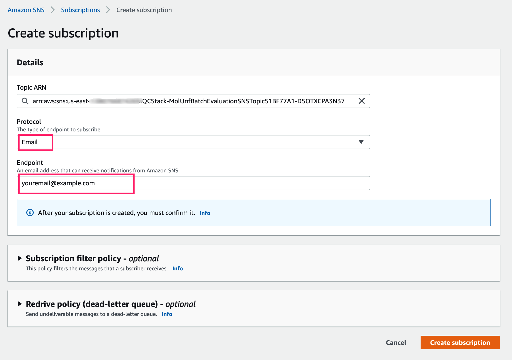
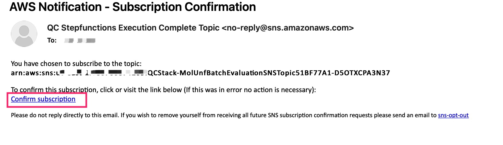

Before you launch the solution, review the architecture, supported regions, and other considerations discussed in this guide. Follow the step-by-step instructions in this section to configure and deploy the solution into your account.

**Time to deploy**: Approximately 10 minutes

## Prerequisites

### Sign up for QuickSight

!!! notice
    You need administrator permission to sign up for QuickSight

* Sign in to the AWS Management Console, navigate to [QuickSight](https://quicksight.aws.amazon.com/).

* If you did not have a QuickSight account, you need to sign up for QuickSight.

* Choose **Enterprise**, click continue.

* In the **Create your QuickSight account** page, fill the necessary information:

Figure 1: Fill information for QuickSight

### Get QuickSight Username (administrator)

* Go to [QuickSight Admin](https://us-east-1.quicksight.aws.amazon.com/sn/admin), record your **QuickSight Username**(not QuickSight account name).

Figure 2: QuickSight username

### Get QuickSight Username (non-administrator)

* You need to ask administrator or the person who has the correct AWS Identity and Access Management (IAM) permissions to [sign up for QuickSight](https://docs.aws.amazon.com/quicksight/latest/user/signing-up.html) in your AWS account.

* Navigate to [QuickSight](https://quicksight.aws.amazon.com/), fill your email in below screen:

Figure 3: QuickSight email

* Go to [QuickSight Admin](https://us-east-1.quicksight.aws.amazon.com/sn/admin), record your **QuickSight Username**(not QuickSight account name).

## Deployment

Use the following steps to deploy this solution on AWS.

* Step1: Launch the AWS CloudFormation template into your AWS account to deploy the solution
* Step2: Update QuickSight permissions
* Step3: Subscribe SNS notification (optional)

!!! notice

    Step2 is one time setup per account when deploying this solution for the first time. You don't have to do them when repeating deployment

### Step1: Launch the AWS CloudFormation template into your AWS account to deploy the solution

This automated AWS CloudFormation template deploys the solution in the AWS Cloud.

* [Launch solution in AWS Standard Regions][template-url] to deploy solution via the AWS CloudFormation template.

* The template launches in the US West(Oregon) by default. To launch this solution in a different AWS Region(for example `us-east-1`), use the Region selector in the console navigation bar.

* Under **Parameters**, review the parameters for the template and modify them as necessary. This solution uses the following values. Choose **Next**.

|      Parameter      |   Description |
|:-------------------:|:----:|
| QuickSightUser | **QuickSight Username** |

* On the **Configure stack options** page, choose **Next**.

* On the **Review** page, review and confirm the settings. Check the box acknowledging that the template will create AWS Identity and Access Management (IAM) resources.

* Choose **Create stack** to deploy the stack.

You can view the status of the stack in the AWS CloudFormation Console in the **Status** column. You should receive a CREATE_COMPLETE status in approximately 10 minutes.

### Step2: Update QuickSight permissions

* Navigate to QuickSight [admin page](https://us-east-1.quicksight.aws.amazon.com/sn/admin#aws)

* Click **Manage**

Figure 4: Manage QuickSight

* Click **Select S3 Buckets**

Figure 5: Check S3 in QuickSight

* Check the bucket `amazon-braket-qcstack-<AWS account>-<region>`

Figure 6: Select S3 in QuickSight

* Click **Finish** and then **Save**

### Step3: Subscribe SNS notification (optional)

This step is optional.

Follow below steps to subscribe SNS notification via Email, you might subscribe the notification via [text messages](https://docs.aws.amazon.com/sns/latest/dg/sns-mobile-phone-number-as-subscriber.html).

* Get your SNS topic name in the CloudFormation deployment output

Figure 7: SNS topic name

* Navigate to [SNS topics](https://console.aws.amazon.com/sns/v3/home?region=us-east-1#/topics) AWS console.

* Click the SNS topic which is in CloudFormation deployment output.

* Click **Create subscription** button.

* Subscribe the SNS topic by email, fill **Protocol** and **Endpoint**, click **Create subscription**.

    - Protocol: **Email**
    - Endpoint: `<your-email-address>`

Figure 8: Subscribe SNS by email

* Confirm subscription.

    Check inbox of your email, you will get an email as below, click the **Confirm subscription** link to confirm the subscription.

Figure 9: Confirm subscription

[template-url]: https://console.aws.amazon.com/cloudformation/home?region=us-west-2#/stacks/create/template?stackName=QRADDStack&templateURL=https://aws-gcr-solutions.s3.amazonaws.com/AWS-gcr-qc-life-science/v0.8.2/default/QCStack.template.json