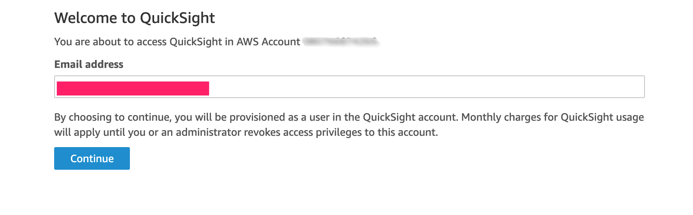

在部署解决方案之前，建议您先查看本指南中有关架构图和区域支持等信息。然后按照下面的说明配置解决方案并将其部署到您的帐户中。

**部署时间**：约 10 分钟。

## 先决条件
### 注册您的QuickSight账户

!!! notice
    注册QuickSight账户，您需要管理员权限。

* 登录到AWS控制台，并找到[QuickSight](https://quicksight.aws.amazon.com/)。

* 如果您还没有QuickSight账户，您需要先注册一个。

* 选择 **Enterprise**，点击 continue。

* 在 **Create your QuickSight account** 页面填写必要的信息:

图 1: 在Quicksight填写信息

### 获取 QuickSight 用户名 (管理员)

* 进入[QuickSight Admin](https://us-east-1.quicksight.aws.amazon.com/sn/admin)，并记录您的**QuickSight Username**(不是QuickSight account name)。

图 2: QuickSight用户名

### 获取 QuickSight 用户名 (非管理员)

* 您需要管理或有相应权限的人员，在您的亚马逊云账号中[注册QuickSight账号](https://docs.aws.amazon.com/quicksight/latest/user/signing-up.html)。

* 进入[QuickSight](https://quicksight.aws.amazon.com/)，在下面的页面中填写您的电子邮件地址:

Figure 3: QuickSight 电子邮件

* 进入[QuickSight Admin](https://us-east-1.quicksight.aws.amazon.com/sn/admin)，并记录您的**QuickSight Username**(不是QuickSight account name)。

## 部署概述
在亚马逊云科技上部署本解决方案主要包括以下过程：

- 步骤1：在您的亚马逊云科技账户中启动Amazon CloudFormation模板
- 步骤2：更新您的QuickSight权限
- 步骤3: 订阅SNS通知 (可选)

!!! 注意

    在初次部署时，每个帐户只需进行一次步骤2，重复部署时不必这样做。

## 部署步骤

### 步骤1：在您的亚马逊云科技账户中启动Amazon CloudFormation模板

我们将AWS CloudFormation的模板部署在了AWS Cloud上。

* 点此通过 AWS CloudFormation模板来[部署解决方案][template-url]。
 
* 模板默认使用US West(Oregon) 启动. 如果想要更换启动模板的 AWS Region，请在控制台的导航栏中使用 Region selector进行更改。

* 在**Parameters**下方，检查模板的参数并将其设置为相应值， 选择 **Next**。

| 参数   | 描述 |
|:-------------------:|:----:|
| QuickSightUser | **QuickSight Username** |

    

* 在 **Configure stack options** 页面中，选择 **Next**。
   
* 在 **Review** 页面中，检查并确认设置。 检查 box acknowledging 确保模板将会创建AWS Identity和Access Management (IAM)资源。

* 选择 **Create stack** 来部署stack。

您可以在AWS CloudFormation控制台中**Status**栏中查看stack的状态。您在大约十分钟内应该看到CREATE_COMPLETE的状态。

### 步骤2: 更新QuickSight的权限

* 定位到QuickSight [admin page](https://us-east-1.quicksight.aws.amazon.com/sn/admin#aws)

* 点击 **Manage**

图 4: 管理QuickSight

* 点击**Select S3 Buckets**

图 5: 在QuickSight里检查S3

* 检查S3桶 `amazon-braket-qcstack-<AWS account>-<region>`

图 6: 在QuickSight里选择S3

* 点击 **Finish** 并选择 **Save**

### 步骤3: 订阅SNS通知 (可选)

本步骤是可选的。

当批量评估执行完成后，如果您想获得Email通知，可以按照下面的步骤订阅SNS通知，您也可以通过[短信](https://docs.aws.amazon.com/sns/latest/dg/sns-mobile-phone-number-as-subscriber.html)订阅通知。

* 在CloudFormation部署的输出中获取SNS主题的名字。

Figure 7: SNS 主题名字

* 转到[SNS 主题](https://console.aws.amazon.com/sns/v3/home?region=us-east-1#/topics)。

* 点击在CloudFormation部署的输出中的SNS主题。

* 点击 **Create subscription** 按钮。

* 通过邮件订阅SNS主题，填写 **Protocol** 和 **Endpoint**，点击 **Create subscription**。

    - Protocol: **Email**
    - Endpoint: `<your-email-address>`

Figure 8: 邮件订阅SNS主题

* 确认订阅， 检查您的邮件收件箱，您将收到如下的一封邮件，点击邮件中 *Confirm Subscription* 链接，确认订阅。

Figure 9: Confirm subscription

[template-url]: https://console.aws.amazon.com/cloudformation/home?region=us-west-2#/stacks/create/template?stackName=QRADDStack&templateURL=https://aws-gcr-solutions.s3.amazonaws.com/AWS-gcr-qc-life-science/v0.8.2/default/QCStack.template.json